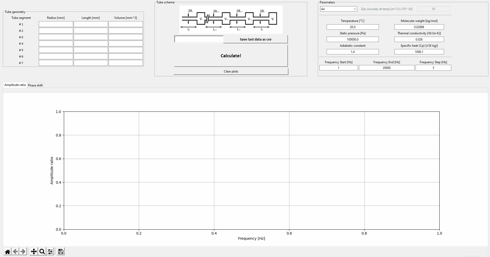

# # Acoustic response in a one side opened multi-secction-tube. According to Bergh-Tidjeman model. (Theoretical and experimental results for the dynamic response of pressure measuring systems by H.Bergh and H.Tijdeman - 1965)

For a series-connection of N thin tubes and N volumes a general recursion formula has been derived that relates the sinusoidal pressure disturbance in volume j to the pressure disturbances in the preceding volume (j -l ) and the next volume (j+1). This forms the basis for expressions to predict the dynamic response of all types of pressure measuring systems and other pneumatic or hydraulic line systems. The theoretical predictions are validated bij experminental results.

